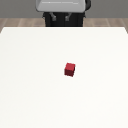

# MuJoCo-sim：多机械臂仿真与示范数据采集平台

基于 **MuJoCo + robosuite** 的多机械臂仿真、浏览器遥操作、示范数据采集、回放与
VLA 数据准备平台。项目首先用 Panda 跑通完整数据链路，再逐步扩展到三臂、四臂任务；
实验室 Piper 真机数据属于后续独立实验阶段。

> 当前版本已经能够运行单臂 Lift、双臂彩色方块交接入盒、无显示器 EGL/OSMesa
> 渲染、Mac 浏览器遥操作、事件触发采集、HDF5 回放以及 COMMVLA 输入准备。

## 项目定位

本项目服务于“多个独立机械臂 agent 协作”的研究设定。每个 agent 有自己的腕部视觉、
本体状态和动作，任务可以另外保存全局相机用于人工操作、诊断和离线评估。

当前 Panda 是稳定的数据链路基线，并不是最终硬件限制。仿真数据用于验证任务、采集、
同步、回放和模型接口；计划中的 Piper 真机实验将直接用真机采集数据微调双臂模型，
不要求把 Panda 仿真轨迹作为 sim-to-real 训练数据。

## 当前已实现功能

| 模块 | 状态 | 内容 |
| --- | --- | --- |
| 单臂任务 | 可运行 | Panda Lift：抓取红色方块并抬升 |
| 双臂任务 | 可运行 | 两台 Panda 完成指定颜色方块的真实交接并投入同色开口盒 |
| 无头渲染 | 已验证 | NVIDIA EGL GPU 渲染；OSMesa CPU 诊断后备 |
| Web 遥操作 | 可运行 | 任务大厅、三路相机、键盘控制、单人分阶段控制双臂 |
| 轨迹管理 | 可运行 | 开始、结束、回放、确认、丢弃、追加、可恢复删除 |
| 事件触发采集 | 可运行 | 20 Hz 仿真，压缩长时间无输入等待，保留动作与接触尾段 |
| 数据格式 | 已验证 | 单臂/双臂 HDF5、MuJoCo state、相机、本体状态、动作和元数据 |
| COMMVLA 准备 | 已验证 | 生成 agent/相机映射与 1%/99% 统计量 |
| 三臂/四臂 | 路线图 | 双臂端到端试采稳定后依次实现 |

双臂任务不是“把两只手臂分别录制后拼接”。任一机械臂产生有效动作时，所有 agent 的
动作、状态和相机观测会在同一个时间索引同步保存。

## 场景预览

下面是仓库内置的 Panda Lift EGL 渲染结果：



仓库还包含：

- [Lift 成功接触帧](artifacts/replay/lift_scripted_success_contact.png)
- [Lift 样例轨迹回放 MP4](artifacts/replay/lift_scripted_test_3_ep1.mp4)
- EGL、OSMesa 与默认后端的 smoke-test PNG

双臂 `ColoredHandoverBox` 场景包含两台相向、固定在桌面的 Panda，发送侧的红/绿/蓝
方块、接收侧的红/绿/蓝开口盒，以及一个全局相机和每台机械臂自带的
`eye_in_hand` 腕部相机。任务要求 Panda 0 抓取指定颜色方块、在中间真实交给
Panda 1，再由 Panda 1 放入同色盒。

## 项目结构

```text
MuJoCo-sim/
├── src/multiarm_sim/
│   ├── lift.py                 # 单臂 Lift 环境工厂与观测处理
│   ├── envs/handover_box.py    # 双 Panda 彩色方块交接入盒任务
│   ├── dataset.py              # 单臂 HDF5 缓冲、保存与验证
│   ├── dual_dataset.py         # 双臂同步 HDF5、删除与恢复
│   └── teleop_recording.py     # 事件触发录制判定
├── scripts/
│   ├── teleop_web.py           # 统一单臂/双臂 Web 数据采集台
│   ├── collect_scripted_lift.py
│   ├── replay_lift_dataset.py
│   ├── prepare_commvla.py
│   ├── prepare_handover_commvla.py
│   └── check_runtime.py
├── tests/                      # 相机、录制、HDF5 与 Web 回归测试
├── docs/                       # 环境、操作手册、设计规格与实施记录
├── datasets/
│   └── lift_scripted_test_3.h5 # 内置三条成功 Lift 教学轨迹
├── artifacts/
│   ├── smoke/                  # EGL/OSMesa 渲染检查
│   ├── replay/                 # 成功帧与 MP4 回放
│   └── commvla_lift_test_3/    # COMMVLA 映射与统计
├── requirements-sim.txt        # 最小直接依赖
├── requirements-lock-linux-py310.txt
├── environment.yml
└── ChatGPT-MuJoCo 多机械臂仿真.md
```

目录只为实际使用的模块增长，不预先创建空的三臂、四臂实现。

## 环境与平台要求

已验证服务器平台：

- Ubuntu 24.04.3 LTS，Linux x86_64，glibc 2.39
- Python 3.10.20
- MuJoCo 3.8.1
- robosuite 1.5.2
- NumPy 1.26.4
- NVIDIA EGL（GPU 首选）与 Mesa OSMesa（CPU 后备）

使用 EGL 不要求服务器存在桌面会话或显示器，但需要可用的 NVIDIA 驱动和 EGL。
项目不依赖 PyTorch、Transformers、LeRobot 等训练栈，避免训练环境与仿真环境互相污染。
CUDA Toolkit 不是 Python 依赖；EGL 路径使用服务器已安装的显卡驱动。

## 安装

克隆仓库：

```bash
git clone https://github.com/NEBULIS-Lab/MuJoCo-sim.git
cd MuJoCo-sim
```

### Conda

```bash
conda env create -p .conda/env -f environment.yml
conda activate ./.conda/env
python -m pip install --no-deps -e .
```

### 独立 venv

```bash
python3.10 -m venv .venv
source .venv/bin/activate
python -m pip install --upgrade pip setuptools wheel
python -m pip install -r requirements-sim.txt
python -m pip install --no-deps -e .
python -m pip check
```

`requirements-sim.txt` 是人工维护的最小依赖；若需要尽量复现本项目验证时的完整
Linux Python 3.10 环境，使用：

```bash
python -m pip install -r requirements-lock-linux-py310.txt
python -m pip install --no-deps -e .
```

没有互联网的服务器可以在联网的 Linux x86_64 机器或 `linux/amd64` 容器中提前下载
wheelhouse。Apple Silicon Mac 下载 Linux wheel 的详细方法见
[服务器环境与 Mac 遥操作说明](docs/environment-and-teleop.md)；不要把 Linux wheel
安装到 macOS 环境。

## 快速验证

先激活环境，再检查 MuJoCo 后端：

```bash
python scripts/check_runtime.py --backend egl --egl-device 6
python scripts/smoke_lift.py --backend egl --egl-device 6 \
  --output artifacts/smoke/lift_agentview_egl.png
```

GPU 编号只是示例。先运行 `nvidia-smi`，选择空闲设备。如果 EGL 不可用，可检查 CPU
离屏路径：

```bash
python scripts/check_runtime.py --backend osmesa
python scripts/smoke_lift.py --backend osmesa \
  --output artifacts/smoke/lift_agentview_osmesa.png
```

## 启动 Web 数据采集台

服务器端：

```bash
cd /path/to/MuJoCo-sim
source .venv/bin/activate

python scripts/teleop_web.py \
  --backend egl \
  --egl-device 6 \
  --image-size 512 \
  --port 8765 \
  --dataset-dir datasets \
  --max-recording-steps 1200
```

服务默认监听 `127.0.0.1:8765`。它不会直接开放到局域网或公网；Linux 服务器负责
物理、渲染和 HDF5，远端电脑的浏览器只查看 JPEG 并发送输入。

网页首页可以选择：

- 单臂 `Panda Lift`
- 双臂“彩色方块交接入盒”
- 后续多臂任务入口（当前未实现）

任务页左侧显示全局相机，右侧上下排列发送臂和接收臂腕部相机；下方提供轨迹确认、
已保存数据回放以及回收站恢复。

## SSH 本地端口转发与多电脑访问

Mac 或其他客户端建立 SSH 本地端口转发：

```bash
ssh -N -o ExitOnForwardFailure=yes \
  -L 8765:127.0.0.1:8765 \
  hkust
```

保持终端运行，在浏览器打开：

```text
http://127.0.0.1:8765
```

如果本机 `8765` 已被占用，或第二台电脑希望使用另一个本地端口：

```bash
ssh -N -o ExitOnForwardFailure=yes \
  -L 8766:127.0.0.1:8765 \
  hkust
```

第二台电脑访问 `http://127.0.0.1:8766`。不同电脑可以使用相同本地端口，因为端口
空间彼此独立。

> **多电脑访问不等于多用户隔离。** 所有浏览器连接同一个服务端 `AppState`、同一个
> MuJoCo 环境和同一份数据。开始、按键、结束、保存和删除都会互相影响。当前只允许
> 一台电脑实际控制；其他电脑若用于观察，不应点击页面或发送按键。

## 遥操作与事件触发采集

通用键盘控制：

```text
A / D    桌面 X 轴负向 / 正向
W / S    桌面 Y 轴正向 / 负向
R / F    上升 / 下降
U / O    末端 roll
I / K    末端 pitch
J / L    末端 yaw
Space    切换当前机械臂夹爪开合
```

双臂选择：

```text
1        Panda 0（发送臂）
2        Panda 1（接收臂）
Tab      在两臂间切换
```

两台 Panda 底座方向相反，但服务端会把共同桌面坐标控制转换到各自 base frame，操作者
不需要手工反转按键。

双臂交接建议按三个阶段完成：

1. **左臂抓取**：Panda 0 移到目标颜色方块上方，下降、闭合并抬升。
2. **中间交接**：Panda 0 把方块送到中央；切换 Panda 1 夹住，再让 Panda 0 释放。
3. **右臂入盒**：Panda 1 把方块移动到同色开口盒，下降并释放。

点击“开始新轨迹”后，仿真继续以 20 Hz 运行，但事件触发采集器只保留有意义的时间步：

- 按住位移或旋转键时以 20 Hz 保存；
- 松开运动键后保留 0.30 秒（6 步）物理尾段；
- 切换夹爪后保留 0.50 秒（10 步）抓取/释放尾段；
- 阶段切换和首次成功至少保留一帧；
- 无输入思考期间不增加有效步数，但 `wall_timestamps` 保留真实等待时间。

网页取流目标为 10 FPS，与 20 Hz 仿真/动作频率相互独立。遥操作心跳超时或页面失焦会
清除运动按键，避免断线后持续移动。

轨迹结束后先进入待确认区：

1. 用播放按钮或滑块检查全局和腕部画面。
2. 成功或有研究价值时确认保存到 HDF5。
3. 无效轨迹直接丢弃。
4. 已保存轨迹删除前会复制到 `*.trash.h5`，可从回收站恢复。

## 内置样例数据与产物

仓库直接包含可用于学习和验证的单臂脚本数据：

| 文件 | 内容 |
| --- | --- |
| `datasets/lift_scripted_test_3.h5` | 3 条成功 Lift 轨迹，长度分别为 75、69、75 步 |
| `artifacts/replay/lift_scripted_test_3_ep1.mp4` | `trajectory_000001` 状态回放 |
| `artifacts/replay/lift_scripted_success_contact.png` | 成功抓取接触检查帧 |
| `artifacts/smoke/*.png` | EGL、OSMesa 和默认后端渲染检查 |
| `artifacts/commvla_lift_test_3/mujoco_lift_input.json` | COMMVLA 任务/agent/相机映射 |
| `artifacts/commvla_lift_test_3/mujoco_lift_statistics.npz` | proprio 与动作分位数 |

该 HDF5 是脚本专家生成的单臂教学数据，不是人类双臂数据。双臂
`datasets/handover_box_human.h5` 需要通过 Web 采集台在本地生成。

重新生成三条 Lift：

```bash
python scripts/collect_scripted_lift.py \
  --episodes 3 \
  --seed 1300 \
  --image-size 256 \
  --backend egl \
  --egl-device 6 \
  --output datasets/lift_scripted_test_3.h5
```

回放内置轨迹：

```bash
python scripts/replay_lift_dataset.py \
  datasets/lift_scripted_test_3.h5 \
  --trajectory trajectory_000001 \
  --camera agentview \
  --backend egl \
  --egl-device 6 \
  --output artifacts/replay/lift_scripted_test_3_ep1.mp4
```

## 数据集结构与 COMMVLA 准备

单臂轨迹主要训练字段：

```text
trajectory_xxxxxx/
├── actions/panda-0                         [T, 7]
├── obs/agent/panda-0/qpos                  [T, 9]
├── obs/sensor_data/agentview/rgb           [T, H, W, 3]
└── obs/sensor_data/robot0_eye_in_hand/rgb  [T, H, W, 3]
```

双臂轨迹把两个 agent 同步保存在同一个时间轴：

```text
trajectory_xxxxxx/
├── actions/panda-0                         [T, 7]
├── actions/panda-1                         [T, 7]
├── obs/agent/panda-0/qpos                  [T, 9]
├── obs/agent/panda-1/qpos                  [T, 9]
├── obs/sensor_data/agentview/rgb           [T, H, W, 3]
├── obs/sensor_data/robot0_eye_in_hand/rgb  [T, H, W, 3]
└── obs/sensor_data/robot1_eye_in_hand/rgb  [T, H, W, 3]
```

另外保存 MuJoCo state、时间戳、奖励、成功标记、任务阶段、active arm、
`wall_timestamps` 和 `capture_reason`，用于精确回放与采集诊断。

准备内置单臂 COMMVLA 资产：

```bash
python scripts/prepare_commvla.py \
  datasets/lift_scripted_test_3.h5 \
  --output-directory artifacts/commvla_lift_test_3
```

准备双臂 COMMVLA 资产：

```bash
python scripts/prepare_handover_commvla.py \
  datasets/handover_box_human.h5 \
  --output-dir artifacts/commvla_handover_box
```

双臂准备脚本默认拒绝混有失败示范的数据集；诊断时才显式添加
`--allow-failures`。参考 COMMVLA 项目在本项目开发中保持只读，本仓库不会修改它。

## 测试

完整 EGL 回归：

```bash
MUJOCO_GL=egl MUJOCO_EGL_DEVICE_ID=6 \
  python -m pytest -q
```

相机专项测试：

```bash
MUJOCO_GL=egl MUJOCO_EGL_DEVICE_ID=6 \
  python -m pytest tests/test_camera_configuration.py -q
```

无 GPU 时可以先运行不构建 EGL 场景的帮助和单元路径；完整物理/相机回归仍应在
EGL 或正确安装 OSMesa 的 Linux 环境执行。

## 设计边界与已知限制

- 当前 Web 服务只有一个共享会话，没有账户、权限或多用户动作仲裁。
- 全局相机可用于人工操作和数据诊断；分布式 VLA 是否获得全局视角必须由实验配置明确。
- 事件触发采集压缩静止等待，但用真实 `wall_timestamps` 和原因位保留审计信息。
- Panda 和实验室 Piper 在自由度、连杆、夹爪、相机外参和控制接口上不同。当前 Panda
  数据链路不能代替 Piper 真机数据。
- 新采集的人类数据可能包含未审查内容，而且 HDF5 会迅速变大，因此默认不自动加入 Git。
  公开数据前必须检查隐私、许可、任务质量和文件大小；大文件使用 Git LFS 或 GitHub Release。
- 当前内置数据只用于格式、回放和小规模接口验证，不足以评估 VLA 泛化能力。

## 三臂与四臂路线图

1. 用当前双臂交接任务采集 10–20 条 pilot，完成保存、回放、数据验证和 COMMVLA batch
   加载。
2. 把现有双臂索引接口抽象为通用 N-agent 环境、动作、观测和网页选择协议。
3. 设计与双臂任务语义连续的三臂 relay / sorting 任务，并验证单人分阶段遥操作。
4. 三臂模式稳定后扩展到四臂，避免把双臂的 `left/right` 假设复制到多臂代码。
5. 独立开展 Piper MJCF、控制器、碰撞、夹爪、腕部相机和真机采集适配。

## 进一步文档

- [服务器环境与 Mac 遥操作说明](docs/environment-and-teleop.md)
- [Panda Lift 与人类遥操作](docs/lift-test-and-human-teleop.md)
- [双臂彩色方块交接与网页采集台](docs/handover-box-and-web-console.md)
- [完整 ChatGPT 讨论记录](ChatGPT-MuJoCo%20多机械臂仿真.md)
- [设计规格与实施计划](docs/superpowers/)

这些文档记录了环境核查、任务设计、失败原因、采集语义和演进过程，适合在修改三臂、
四臂或新数据格式前阅读。

## License

代码与随仓库发布的项目材料采用 [MIT License](LICENSE)。第三方 MuJoCo、robosuite
及其模型资产仍遵循各自许可证。
